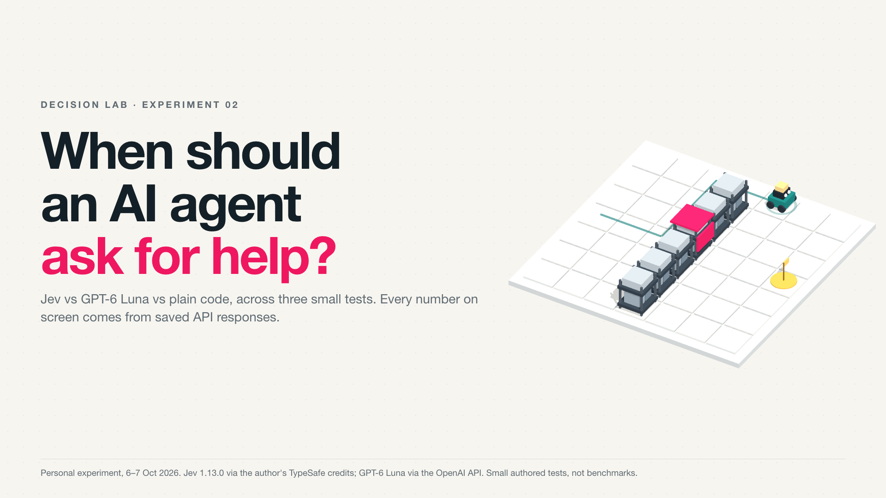
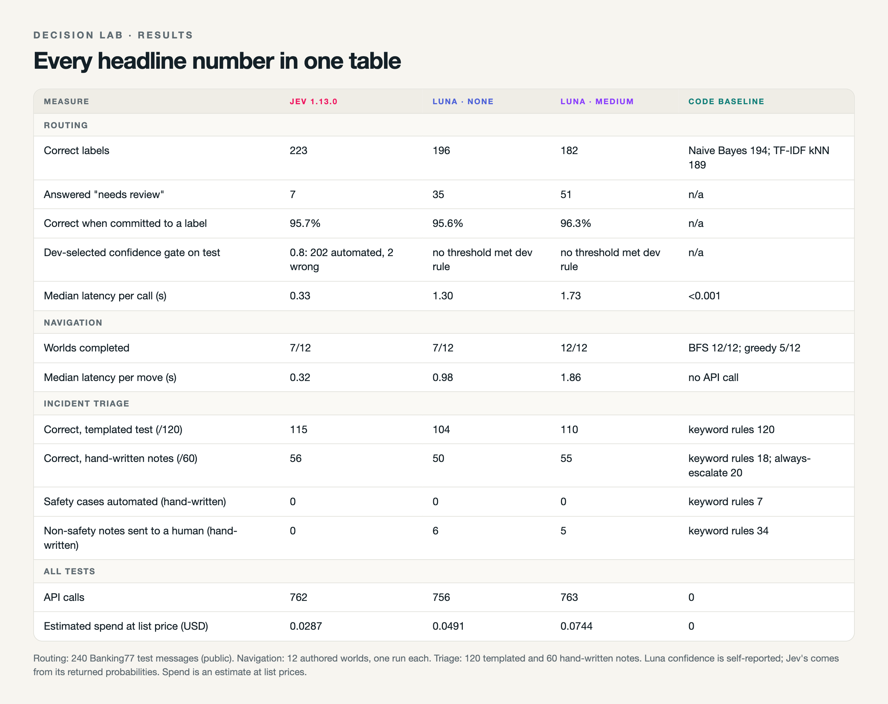
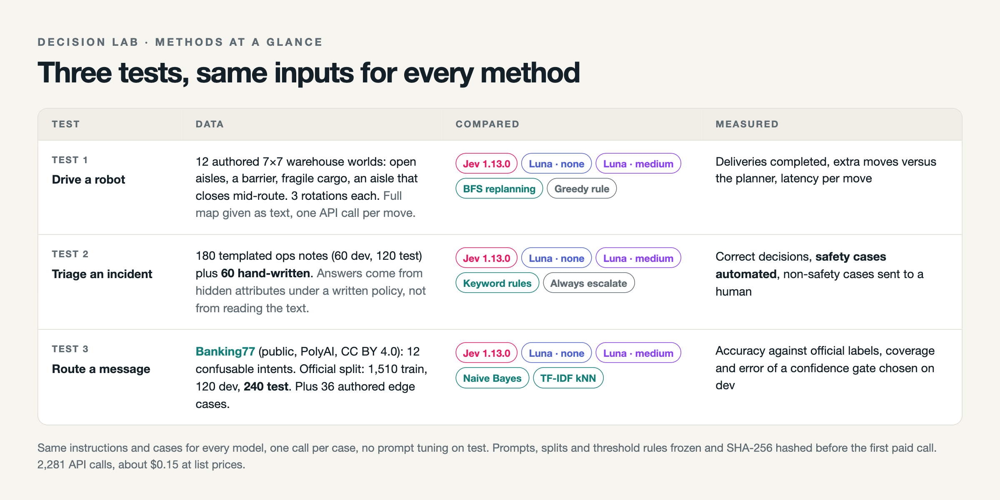
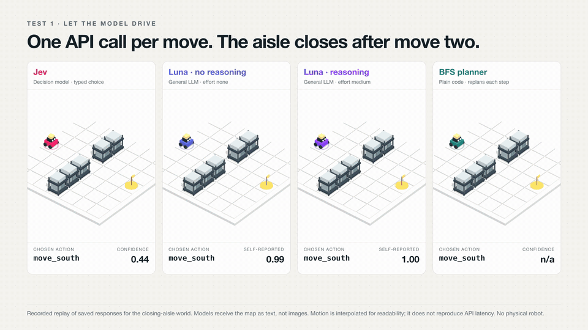

# Decision Lab: Jev vs GPT-6 Luna vs plain code

Where should an AI agent use a model, which model, and when should it hand the decision to a person? Three small tests, same inputs for every method:

1. **Drive a robot** through a warehouse where an aisle closes mid-route, one API call per move.
2. **Triage an incident**: code drives, the model only reads an ops note and picks wait, reroute or escalate.
3. **Route a message**: pick the right support intent for real Banking77 customer messages, or ask for review.

2,281 real API calls, about $0.15 at list prices. Every number below is recomputed from the raw responses in `results/` by `src/analyze.py` and checked by `src/validate.py`.

Write-up: *[Medium link]* · Film: *[video link]*



## Results

| | Jev 1.13.0 | GPT-6 Luna, reasoning `none` | GPT-6 Luna, reasoning `medium` | Code baseline |
|---|---|---|---|---|
| **Test 1** · warehouse worlds completed (of 12) | 7 | 7 | **12** | BFS **12**, greedy 5 |
| Median latency per move | 0.32 s | 0.98 s | 1.86 s | no API call |
| **Test 2** · hand-written incident notes correct (of 60) | **56** | 50 | 55 | keyword rules 18 |
| Safety cases automated (of 20) | 0 | 0 | 0 | keyword rules **7** |
| **Test 3** · Banking77 test messages correct (of 240) | **223** | 196 | 182 | Naive Bayes 194, TF-IDF 189 |
| Answered "needs review" | 7 | 35 | 51 | n/a |
| Correct when committed to a label | 95.7% | 95.6% | 96.3% | n/a |
| Confidence gate chosen on dev, applied to test | 0.8: 202 automated, 2 wrong | no threshold met the rule | no threshold met the rule | n/a |

What the numbers say, briefly:

- **Planning needs a planner.** Without reasoning, both models looped in the same worlds; Jev's moves matched the greedy distance rule move for move in two of the three closing-aisle worlds. Luna with reasoning completed all 12 with no extra moves, like breadth-first search, at about 6× Jev's latency per move.
- **Models earn their place on messy text.** Keyword rules scored 120/120 on templated notes and 18/60 on hand-written ones, and automated 7 safety cases. No model automated any.
- **Confidence has to be tested before you gate on it.** Jev's distribution-derived confidence passed a threshold rule fixed in advance. Luna's self-reported confidence did not; without reasoning it reported 0.96 or higher on seven of its eight wrong automated triage answers.

Banking77 accuracy for Jev: 95% Wilson interval 89.0% to 95.5%. Jev's lead over each other method holds on a paired exact McNemar test (p < 0.001). Most of Luna's routing misses are abstentions, which count against the official label.



## Methods

**Data.** Test 3 uses [Banking77](https://github.com/PolyAI-LDN/task-specific-datasets/tree/master/banking_data) (PolyAI, CC BY 4.0; [Casanueva et al., 2020](https://arxiv.org/abs/2003.04807)): 13,083 real banking queries, 77 intents. Twelve easily confused intents were chosen before any model call. From the official training split, 1,510 messages train the baselines and 120 form a development set; from the official test split, 240 messages (20 per intent, seed 20261006). No message appears in two sets. See [`data/README.md`](data/README.md).

Tests 1 and 2 are authored, because no public dataset fits:

- **Warehouse:** 12 worlds on a 7×7 grid (open aisles, a barrier, fragile cargo, an aisle that closes after move two), each in three rotations. The model receives the full map as text, its position, cargo rules, each neighbouring cell's status and distance to goal, and its last six moves. Code validates and executes every move. A run fails at five visits to one cell or 32 moves. See `world/protocol.json`.
- **Incident notes:** 180 templated notes (6 incident kinds × 5 clearing times × 3 detour costs × 2 writing styles; 60 dev, 120 test) and 60 hand-written notes, evaluated only with thresholds frozen on dev. The correct decision comes from hidden attributes under a written policy, not from reading the text. See `incidents/protocol.json` and [all 60 notes with every method's answer](results/sheets/incident-notes-hand-written.csv).



**Methods compared.** Jev 1.13.0 (TypeSafe), pinned. GPT-6 Luna (`gpt-6-luna`) through the OpenAI Responses API with strict JSON-schema output and `store=false`, at reasoning effort `none` and `medium`. Every model gets the same instructions, label descriptions and cases, one call per case, with no prompt tuning on test data. Luna's confidence is self-reported (0 to 100), because OpenAI documents no log-probabilities for this model; Jev's is derived from its returned probability distribution.

**Frozen before spending.** Prompts, cases, splits, candidate thresholds and the threshold rule (highest coverage with at most 5% dev error and at least 30 accepted cases; 15 for incidents) were written to protocol files and SHA-256 fingerprinted in `manifest.json` files before the first paid call. Scripts refuse to run if any fingerprinted input changes. Two pre-call revisions to the incident protocol are recorded inside it.

**Checked after.** `src/validate.py` re-verifies every fingerprint, split isolation, the metric counts behind each headline number, Jev's confidence formula, and the schema and model version of every routing and incident response; replays all warehouse traces through the simulator; reconciles token counts against both API ledgers; and scans every file for credential-shaped strings.

## Limitations

These are small authored tests, not benchmarks. One run per case. The warehouse worlds, incident notes, triage policy and keyword rules were written by the author, and no warehouse operator reviewed them. Banking77 is public and may appear in model training data; the 36 diagnostic routing cases are not human-adjudicated. The confidence-gate rule picked threshold 0 on the incident notes for every model, because the development set held too few model errors; thresholds discussed above 0 are exploratory. OpenAI's Decisions API returned HTTP 403 for this account and was not tested. Latency is client-side wall time, measured sequentially, and includes the network. Costs are estimates from recorded tokens at published list prices, not invoices.

## Check the numbers

Needs only Python 3.12 and no API key:

```sh
python3 src/analyze.py    # recomputes results/summary.json from the raw responses
python3 src/validate.py   # integrity, metrics, simulator replays, token reconciliation, key scan
```

Rerun the free baselines (deterministic):

```sh
python3 src/benchmark.py local   # Naive Bayes and TF-IDF on Banking77
python3 src/world.py local       # breadth-first search and greedy in the warehouse
python3 src/incidents.py local   # keyword rules and always-escalate
```

## Rerun the paid calls

Model versions and pricing may have changed since October 2026, so treat a rerun as a new experiment. Work in a fresh copy and leave `results/` here untouched.

```sh
python3 -m venv .venv && .venv/bin/pip install -r requirements.txt
cp .env.example .env              # add TYPESAFE_API_KEY and OPENAI_API_KEY
rm results/*.jsonl results/summary.json
.venv/bin/python src/benchmark.py live   # Jev routing
.venv/bin/python src/world.py local      # BFS and greedy warehouse traces
.venv/bin/python src/world.py live       # Jev warehouse
./run_live.sh                            # Jev incidents, then every Luna arm on all three tests
.venv/bin/python src/analyze.py && .venv/bin/python src/validate.py
```

Never rerun `src/prepare.py`, `src/comparator.py prepare`, `src/incidents.py prepare` or `src/world.py prepare` into a published results folder; they rewrite the frozen protocols. `validate.py` asserts this run's exact call and token counts, so a fresh run will need those constants updated.

## Render the film

The 92-second film replays saved responses: GSAP drives a seekable timeline, Three.js draws the warehouse, and `src/film_audio.py` synthesizes the soundtrack from the timeline's own events. Frames are rendered after an overflow check that fails on clipped or overlapping text.

```sh
npm install && npx playwright install chromium
python3 src/film_data.py                          # film/data.json from results/summary.json
python3 -m http.server 8790 --bind 127.0.0.1 &    # serve the repo root
node film/render.js                               # renders/decision-lab-film.mp4 (needs ffmpeg)
```

Models received text, never images; the 3D view is a visualization of saved state. Robot motion in the triage scene is illustrative; the verdicts shown are the saved responses to those notes.



## Repository layout

```
src/
  client.py        Jev client: budget cap, retries, credential-free ledger
  llm_client.py    GPT-6 Luna (and optional Claude) client with the same ledger and budget
  prepare.py       Builds the Banking77 splits and the routing protocol
  benchmark.py     Test 3: local baselines and Jev routing
  world.py         Test 1: warehouse simulator, BFS and greedy baselines, Jev driving
  comparator.py    Tests 1 and 3 for each Luna arm
  incidents.py     Test 2: notes, policy, keyword rules, Jev and Luna triage
  analyze.py       Recomputes every metric into results/summary.json
  validate.py      Independent evidence checks
  film_data.py     Turns results into the film's data
  film_audio.py    Synthesizes the soundtrack from timeline cues
data/              Banking77 subset and licence
protocol.json      Frozen routing protocol (fingerprints in manifest.json)
world/  comparator/  incidents/   Frozen protocols and fingerprints for each test
results/           Raw requests and responses, API ledgers, summary.json, CSV sheets
film/              Film page, timeline and renderer (Three.js and GSAP vendored)
figures/           Figures used in the write-up
run_live.sh        Runs every paid comparison
```

## Licences and disclosure

Code: MIT. Banking77: CC BY 4.0, PolyAI. Three.js: MIT (`film/vendor/THREE-LICENSE.txt`). GSAP: GreenSock's standard no-charge licence. Model outputs in `results/` were generated by Jev 1.13.0 (TypeSafe) and GPT-6 Luna (OpenAI) through the author's accounts.

The Jev calls used the author's TypeSafe API credits; the Luna calls used the author's own OpenAI key. Nobody sponsored this work. Built with Claude Code as a coding assistant.

If you use the Banking77 data, please cite:

```bibtex
@inproceedings{Casanueva2020,
  author    = {I{\~{n}}igo Casanueva and Tadas Tem\v{c}inas and Daniela Gerz and Matthew Henderson and Ivan Vuli\'{c}},
  title     = {Efficient Intent Detection with Dual Sentence Encoders},
  year      = {2020},
  booktitle = {Proceedings of the 2nd Workshop on NLP for ConvAI - ACL 2020}
}
```
